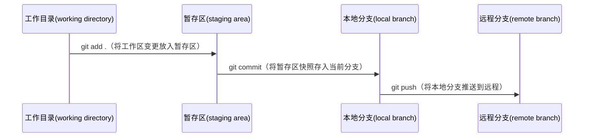

# Git Push Steps

```bash
$ cd <project directory>
$ git checkout -b <branch-name>
     # create a new local branch and swtich to it
$ git add .
    # add all files unders the project directory to the new-created local branch
$ git commit -m "feat: add new feature"
    # push the the code change from the local branch to staging area.
    # if you are fixing a bug you can change it to "fix: fix logout bug"
$ git push -u origin <remote branch name>
    # push the code change to your target remote branch
    # If the branch does not exist, the command creates it. If the branch exists, the command pushes the code onto it.

```
**Overall Flow**

